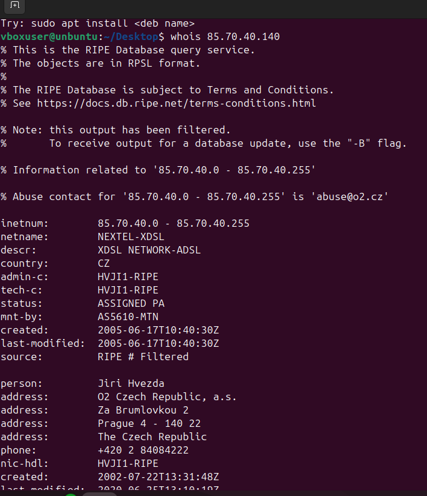
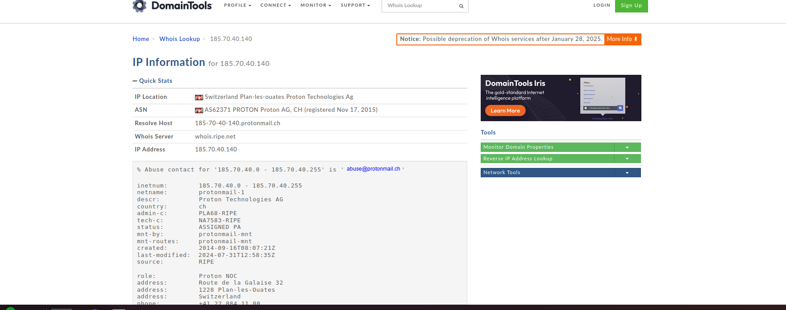
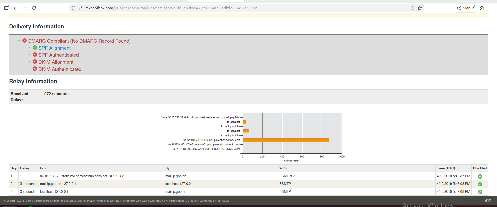
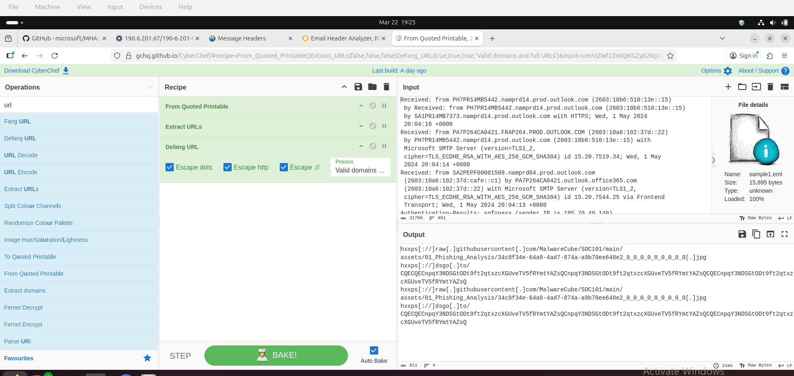
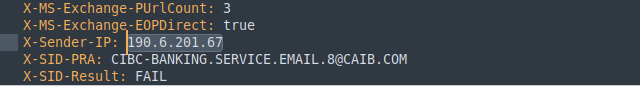
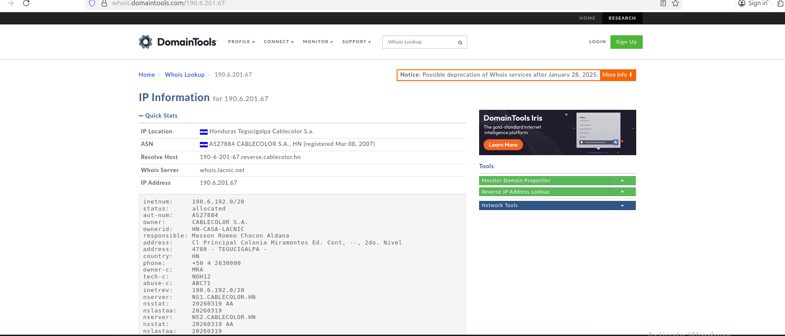

## 🧠 MITRE ATT&CK Integration

This project applies the MITRE ATT&CK framework to map observed phishing behaviors to real-world attacker tactics and techniques.

✔ Reconnaissance  
✔ Initial Access (T1566 – Phishing)  
✔ Command & Control indicators  
✔ Defense Evasion techniques  

This approach aligns with modern SOC investigation workflows.

# Phishing Email Analysis — Portfolio

**Analyst:** Erica Innocent Effiong
**Focus:** Email header forensics, sender investigation, authentication analysis, IOC extraction
**Tools Used:** MXToolBox, DomainTools, CyberChef, Linux Terminal (WHOIS), Thunderbird


---

## About This Repository

This repository documents hands-on phishing email analysis investigations. Each case study covers a real phishing email — analysing the header, sender infrastructure, authentication failures, and malicious content using professional SOC analyst tools.

New cases are added as investigations are completed.

---

## Case Studies

| # | Target Brand | Technique | Sending Country | Severity |
|---|-------------|-----------|-----------------|----------|
| [Case 01](#case-01--chase-bank-impersonation) | Chase Bank (USA) | Display Name Spoofing + Base64 Obfuscation | Switzerland (ProtonMail) | HIGH |
| [Case 02](#case-02--cibc-bank-impersonation) | CIBC Bank (Canada) | Typosquatting (`caib.com`) | Honduras | HIGH |

---

---

# Case 01 — Chase Bank Impersonation

**Classification:** Phishing / Brand Impersonation / Credential Harvesting / Email Obfuscation
**Date:** May 2024

## Overview

A phishing email impersonating Chase Bank designed to trick recipients into clicking a malicious link under the pretense of a suspended bank account. The attacker used ProtonMail infrastructure and encoded the email body in Base64 to evade security scanners.

## Email Metadata

| Field | Value |
|-------|-------|
| **Claimed Sender** | alerts@chase.com |
| **Actual Sending Domain** | protonmail.com |
| **Reply-To** | kellyellin426@proton.me |
| **Return-Path** | kellyellin426@proton.me |
| **Subject** | Your Bank Account has been blocked due to unusual activities |
| **Sending IP** | 185.70.40.140 |
| **Sending Server** | mail-40140.protonmail.ch |

## Header Anomalies

**1. FROM Address Spoofing (CRITICAL)**
The `From` field displays `alerts@chase.com` but the email was sent from ProtonMail.
```
From: alerts@chase.com
Received: from mail-40140.protonmail.ch (185.70.40.140)
```

**2. Reply-To / Return-Path Mismatch (CRITICAL)**
Both fields point to the attacker's personal ProtonMail address.
```
Reply-To: kellyellin426@proton.me
Return-Path: kellyellin426@proton.me
```

**3. DKIM Timeout (HIGH)**
DKIM verification timed out — cryptographic proof that the email came from chase.com could not be established.

**4. SPF Pass on Wrong Domain (HIGH)**
SPF passed for `protonmail.com` only — not for `chase.com`.

**5. Malicious Redirect URL (CRITICAL)**
```
hxxps://dsgo[.]to/CQECQECnpqY3NDSGtODt9ft2qtxzcXGUveTV5fRYmtYAZsQ...
```

**6. Urgency Social Engineering (HIGH)**
Fear-based language pressuring victims to act immediately.

**7. Grammar Error (MEDIUM)**
"tempory" instead of "temporary" — non-professional authorship.

## Sender IP Investigation





| Field | Value |
|-------|-------|
| **IP Owner** | Proton Technologies AG |
| **Location** | Plan-les-Ouates, Switzerland |
| **ASN** | AS62371 PROTON |
| **Abuse Contact** | abuse@protonmail.ch |

## MXToolBox Authentication Analysis



| Check | Result |
|-------|--------|
| DMARC Compliant | ❌ FAIL |
| SPF Alignment | ❌ FAIL |
| SPF Authenticated | ✅ PASS (protonmail only) |
| DKIM Alignment | ❌ FAIL |
| DKIM Authenticated | ❌ FAIL |
| Relay Delay | 5 seconds |

## Advanced Analysis — CyberChef


**CyberChef Base64 Decode**


**URL Extraction & Defanging**



Recipe: `From Quoted Printable → Extract URLs → Defang URL`

```
hxxps://raw[.]githubusercontent[.]com/MalwareCube/SOC101/main/assets/...jpg
hxxps://dsgo[.]to/CQECQECnpqY3NDSGtODt9ft2qtxzcXGUveTV5fRYmtYAZsQ...
```

## IOCs — Case 01

| Type | Value | Severity |
|------|-------|----------|
| Sending IP | 185.70.40.140 | HIGH |
| IP Owner | Proton Technologies AG — Switzerland | HIGH |
| Reply-To | kellyellin426@proton.me | CRITICAL |
| Return-Path | kellyellin426@proton.me | CRITICAL |
| Malicious URL | dsgo[.]to/CQECQECnpqY3... | CRITICAL |
| Claimed Sender | alerts@chase.com (spoofed) | CRITICAL |
| Encoding | Base64 body obfuscation | HIGH |

## MITRE ATT&CK — Case 01

| ID | Technique | Application |
|----|-----------|-------------|
| T1566 | Phishing | Core attack method |
| T1566.002 | Spearphishing Link | Malicious redirect URL |
| T1672 | Email Spoofing | From claims chase.com, sent via ProtonMail |
| T1598 | Phishing for Information | Credential harvesting |
| T1583.001 | Acquire Infrastructure | ProtonMail used as sending platform |
| T1027 | Obfuscated Files or Information | Base64 encoding to evade detection |

---

---

# Case 02 — CIBC Bank Impersonation

**Classification:** Phishing / Brand Impersonation / Typosquatting / Credential Harvesting
**Date:** 2024

## Overview

A phishing email impersonating CIBC (Canadian Imperial Bank of Commerce) using a typosquatted domain (`caib.com` instead of `cibc.com`), routed through a Honduran residential ISP with zero DMARC protection.

## Email Metadata

| Field | Value |
|-------|-------|
| **Claimed Sender** | CIBC-Banking.Service.Email.8@caib.com |
| **Legitimate CIBC Domain** | cibc.com |
| **Attacker Domain** | caib.com (typosquat) |
| **Recipient** | jsmith@technicalsolutions.com |
| **Subject** | You've got 1 new message [REF: 8] |
| **Sending IP** | 190.6.201.67 |
| **X-SID-Result** | FAIL |
| **Relay Delay** | 972 seconds |

## Email Body


## Header Anomalies

**1. Typosquatted Domain (CRITICAL)**
```
Phishing:   CIBC-Banking.Service.Email.8@caib.com
Legitimate: notifications@cibc.com
```

**2. Fake Support Domain (HIGH)**
`myaccount@secure-cibc.com` — not an official CIBC domain.

**3. No Recipient Personalisation (HIGH)**
`Hello jsmith@technicalsolutions.com` — confirms mass phishing campaign.

**4. Outdated Template (MEDIUM)**
Signed "CIBC Service-Team 2019" — reused template from 2019.

**5. Artificial Urgency (HIGH)**
"Deactivated account" + "link only active for 12 hours."

**6. Microsoft SID FAIL (HIGH)**



```
X-Sender-IP:  190.6.201.67
X-SID-Result: FAIL
```

## Sender IP Investigation



| Field | Value |
|-------|-------|
| **IP Owner** | Cablecolor S.A. |
| **Location** | Tegucigalpa, Honduras |
| **ASN** | AS27884 CABLECOLOR S.A., HN |
| **Country** | HN (Honduras) |

CIBC is a Canadian bank. No legitimate CIBC email originates from a Honduran residential ISP.


![MXToolBox Header Input] (cibc/screenshots/04-mxtoolbox-header-input.png)

| Check | Result |
|-------|--------|
| DMARC Compliant | ❌ FAIL — No DMARC Record Found |
| SPF Alignment | ✅ PASS |
| SPF Authenticated | ❌ FAIL |
| DKIM Alignment | ❌ FAIL |
| DKIM Authenticated | ❌ FAIL |
| Relay Delay | 972 seconds (16+ minutes) |

## IOCs — Case 02

| Type | Value | Severity |
|------|-------|----------|
| Sender Domain | caib.com (typosquat of cibc.com) | CRITICAL |
| Sending IP | 190.6.201.67 | HIGH |
| IP Owner | Cablecolor S.A. — Honduras | HIGH |
| Fake Support Email | myaccount@secure-cibc.com | CRITICAL |
| X-SID-Result | FAIL | HIGH |
| Relay Delay | 972 seconds | MEDIUM |

## MITRE ATT&CK — Case 02

| ID | Technique | Application |
|----|-----------|-------------|
| T1566 | Phishing | Core attack method |
| T1566.002 | Spearphishing Link | Malicious "Activate" button |
| T1583.001 | Acquire Infrastructure | Registered typosquatted domain caib.com |
| T1598 | Phishing for Information | Credential harvesting |
| T1036 | Masquerading | caib.com masquerading as cibc.com |

---

---

## Cross-Case Comparison

| Factor | Case 01 — Chase | Case 02 — CIBC |
|--------|----------------|----------------|
| Spoofing Method | Display name spoofing via ProtonMail | Typosquatted domain (caib.com) |
| Sending Country | Switzerland | Honduras |
| DMARC | Failed | No record at all |
| Relay Delay | 5 seconds | 972 seconds |
| Obfuscation | Base64 body encoding | None detected |
| Personalisation | "Dear Customer" | Email address used as name |
| Template Age | Current | 2019 (reused) |

---

## Tools Used

| Tool | Purpose |
|------|---------|
| **Linux Terminal** | WHOIS lookups on sending IPs |
| **DomainTools** | Detailed IP and domain WHOIS investigation |
| **MXToolBox** | Email header authentication analysis |
| **CyberChef** | Base64 decoding, URL extraction, URL defanging |
| **Thunderbird** | Viewing raw email headers and body |

---

## Skills Demonstrated

- Email header forensic analysis
- Sender IP investigation using WHOIS
- SPF, DKIM, and DMARC authentication analysis
- Base64 decoding and content deobfuscation
- URL extraction and defanging
- IOC identification and documentation
- MITRE ATT&CK technique mapping
- Typosquatting detection
- Social engineering pattern recognition

---

## 🎓 Certifications

- MITRE ATT&CK Defender (MAD) – Foundations of Operationalizing ATT&CK v13

*More phishing case studies will be added as investigations are completed.*
*All analysis conducted for educational and portfolio purposes.*